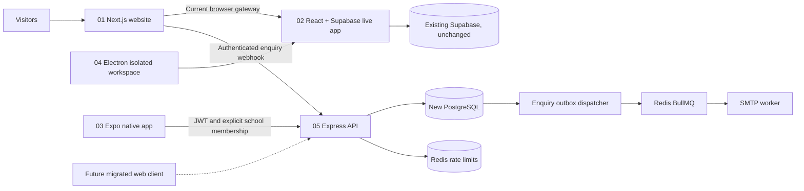

# Architecture and Migration Boundary

The website, API and native clients have independent release lifecycles. The
website never holds learner tokens. The enquiry webhook uses a server-only
shared secret. The API validates JWTs, active refresh families and current
membership before queries; never trust a client-supplied school ID alone.

The new API is not an adapter for the current Supabase frontend. Both remain
separate until a compatible client and rehearsed migration exist. Password
hashes and role identifiers are not assumed compatible between the systems.

## Migration Gates

1. Provision separate staging PostgreSQL/Redis and secret stores. No production service-role keys in CI fixtures.
2. Implement and test remaining role and workflow contracts, especially guardian/student access and staff caseload policy.
3. Build an explicit importer with stable old-to-new IDs, validation reports and idempotency. It is not implemented yet.
4. Rehearse against an authorized, protected backup. Verify record counts, ownership, documents, goals, revisions and audit continuity. Never copy a guardian contact into an enabled account without an approved invitation and identity check.
5. Re-enroll users through a secure account migration flow. Do not copy incompatible password hashes or publish demo passwords.
6. Complete role walkthroughs, exports, security review, accessibility and load/recovery tests. Test a restore before scheduling the switch.
7. Agree a maintenance window or tested change-capture strategy, back up, verify the import, then switch a small approved pilot. Avoid unverified dual writes.
8. Keep the old system read-only during the agreed rollback window. Rollback must reconcile new-system writes before restoring old routing; a DNS change alone is not data rollback.

No DNS, production database, authentication provider or root deploy configuration
has been switched by this branch.
